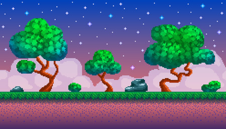
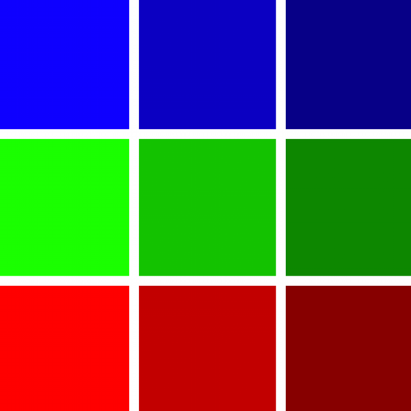

# Preproducción

El desarrollo de videojuegos es un proceso complejo que implica varias etapas, desde la concepción de la idea hasta la publicación y el mantenimiento del juego. En la fase de **preproducción** se define el concepto, la historia, el estilo artístico y el objetivo del juego. También se puede realizar un análisis de mercado para identificar el público objetivo y se elabora un boceto inicial que sirva de base para el desarrollo. Es crucial en esta etapa establecer un plan de trabajo y definir las herramientas y tecnologías que se utilizarán.

Aquí tienes una presentación que explica las principales tareas que abarca esta preproducción:

    <iframe src="pdf/03 - Preproduccion.pdf" width="476px" height="288px" frameborder="0"></iframe>
    
<a href="pdf/03 - Preproduccion.pdf" target="_blank">
        Ver en pantalla completa
    </a>

## Documentos del videojuego

Respecto a los documentos que se elaboran acerca del videojuego, podemos pensar en un documento que explique:

* El **guión** general del juego: en qué va a consistir, personajes, niveles, objetivo final. Cuanto más detallado sea este guión más sencillo será después pasarlo a la fase de diseño y desarrollar el videojuego, sin que surjan dudas o problemas que no hayamos contemplado antes.
* El **plan de trabajo** y la planificación temporal, para tener más o menos claro el tiempo que puede llevar elaborar toda esta etapa

## Diseño del videojuego

A la hora de diseñar el videojuego podemos hacer uso de distintas herramientas de diseño, que nos permitirán definir tanto los distintos escenarios como los personajes, enemigos y objetos que formarán parte de la escena.

En este caso podemos optar por dos tipos de estrategias:

* **Diseños vectoriales**: se elaboran diseños de escenas y personajes mediante programas de dibujo vectorial. Estos programas tienen la ventaja de que son independientes de la resolución, y podemos diseñar elementos que se adaptan a cualquier tamaño de pantalla. Como inconveniente, normalmente el diseño de algunos aspectos es más complicado con estas herramientas. Aquí vemos un ejemplo.

    
    
<em>Imagen vectorial</em>

* **Diseños de mapas de bits y *pixel-art***: se elaboran diseños coloreando los píxeles de un lienzo. Es un estilo conocido como *pixel-art* porque básicamente consiste en dar color a cada píxel, y en general se puede apreciar ese estilo a simple vista analizando la imagen. Aquí vemos un ejemplo.

    
    
<em>Imagen diseñada con pixel-art</em>

A lo largo de los siguientes subapartados de esta sección se explican algunas herramientas para definir diseños de uno y otro tipo.

    

        
        
Inkscape

    

    

        
        
Piskel

    
    

